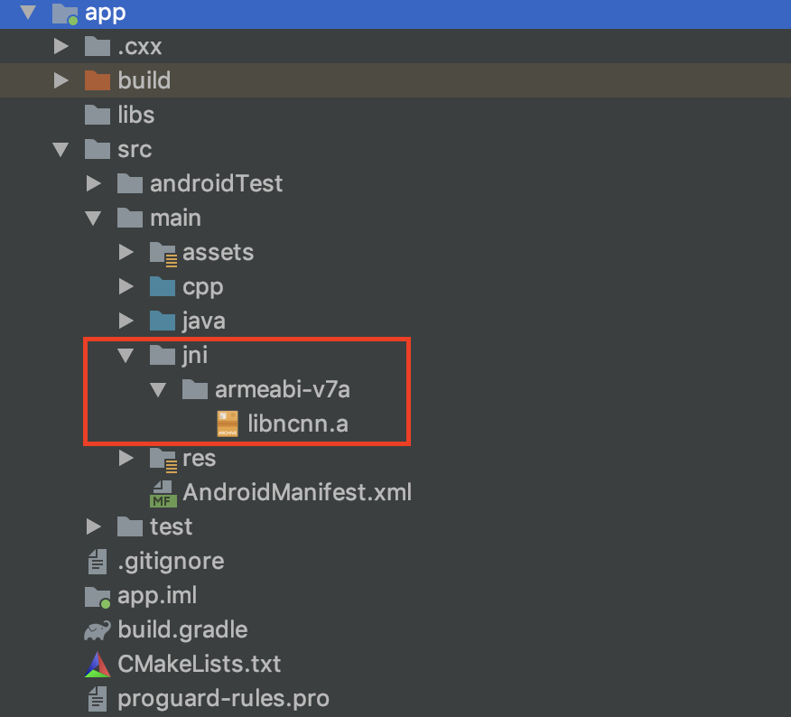

# Android端 mtcnn人脸检测

Email:jiaopaner@163.com

测试手机：Samsung GTI9500 S4 android 5.0.1 / 或者架构为armeabi-v7a都可

1.环境依赖：Android Studio配置jni调用环境，即NDK开发，配置 ndk r19、LLDB、cmake

2.新建具有c++支持的Android项目，并用本项目的app目录替换app目录

3.在app目录中创建jni文件夹，下载ncnn.a 并置于jni目录中 

ncnn下载地址:[ncnn-android-lib.zip](https://github.com/Tencent/ncnn/releases/download/20190908/ncnn-android-lib.zip)

4.连接手机，打开调试模式，运行

结果如下：

